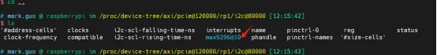
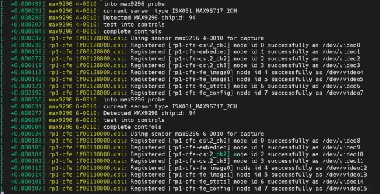

GMSL Camera Adapter Kit Driver for Raspberry Pi 5
====================================  
This repository provides GMSL camera driver for the Raspberry Pi 5. The driver is only compatible with ALG (www.alg-imaging.com) GMSL camera module and adapter board. 
[中文](./README_CN.md)

# Prerequisites
1. GMSL Camera modules(https://www.alg-imaging.com/product/alg-3m-automotive-camera-isx031-driving-front-view-adas-hd-waterproof-gmsl2/)  
2. Adapter board(https://www.alg-imaging.com/solution/alg-4-channel-gmsl-adapter-board-for-raspberry-pi-5/)  
3. Raspberry Pi 5(https://www.raspberrypi.com/products/raspberry-pi-5/)  

# Load device tree
1. Copy the device tree file max9296\bin\6.6.31+rpt-rpi-2712\dtbo\max9296.dtbo from this repository to the directory /boot/firmware/overlays/ on raspberry pi.  
```bash
sudo cp </path/max9296.dtbo> /boot/firmware/overlays/
```
2. Add dtbo to the device tree.  
```bash
sudo vim /boot/firmware/config.txt
```
It needs to change the configuration of camera module in the file, for example, if we use 2-channel of ALG 3MP camera, we add the following lines to config file:   
```bash
dtoverlay=max9296,sensor-type=ISX031_MAX96717_2CH
dtoverlay=max9296,cam0,sensor-type=ISX031_MAX96717_2CH
```
The config file looks like:  
```bash
[all]
#dtoverlay=max9296,sensor-type=0X08B MAX96717 1CH
#dtoverlay=max9296,cam0,sensor-type=0X08B MAX96717 1CH
dtoverlay=max9296,sensor-type=ISX031 MAX96717 2CH
dtoverlay=max9296,cam0,sensor-type=ISX031 MAX96717 2CH
#dtoverlay=max9296,sensor-type=ISX031 MAX96717 1CH
#dtoverlay=max9296,cam0,sensor-type=ISX031 MAX96717 1CH
#dtoverlay=max9296,sensor-type=ISX031 MAX96717 2CH
#dtoverlay=max9296,cam0,sensor-type=0X08B MAX96717 1CH
```
3. Reboot the device. Check if the device is loaded sucessfully.  
```bash
cd /proc/device-tree/axi/pcie@120000/rp1/i2c@80000/max9296@10
```


# Load driver on raspberry pi
1. Check the kernel version on raspberry pi.   
```bash
$ uname -r
```
2. Copy the kernel file (.ko) from this repository to the directory /lib/modules/{$kernel_version} on raspberry pi.  
```bash
sudo cp </path/kernel_2712.img> /lib/modules/{$kernel_version}/
```
3. Run depmod and modprobe.  
```bash
sudo depmod
sudo modprobe max9296
```
If the driver is loaded sucessfully, there'll be message printed on dmesg.  


# Configurate media pipe
On raspberry pi 5, we have to configurate the media pipe mannually. Please copy the aili_run_camera.sh file to any location on raspberry pi and run the following command.  
```bash
./aili_run_camera.sh csi_channel width hight deserdes_channel
```
** Parameters:
- csi_channel: designate CSI(Camera Serial Interface) channel. Avalibles are :  
  csi0 -- use csi0  
  csi1 -- use csi1  
  all  -- both csi0 & csi1  
- width: image width (pixels number horizontal)  
- height: image height (pixels number veritcal)  
- deserdes_channel: use one or two deserdes channels. When using one deserdes channel, user must configure LINKA:
  1ch -- use one channel of deserdes (LINKA)
  2ch -- use two channels of deserdes
** Important Note:  
1) width and height must be consistant with the image sensor output.  
2) on loading the OX08B_MAX96717_1CH driver, deserdes_channel can only be 1ch. 
** Example:  
```bash
./aili_run_camera.sh all 1920 1536 2ch //
```
It means that use both csi0 and csi1, resolution 1920X1536, deserdes output on both channel, capturing 4ch image at same time.  

# Preview image with gstreamer
1. Run the script aili_review_camera.sh to preview image with gstreamer.  
```bash
./aili_review_camera.sh csi_channel width hight deserdes_channel
```
** Parameters:
- csi_channel: designate CSI(Camera Serial Interface) channel. Avalibles are :  
  csi0 -- use csi0  
  csi1 -- use csi1  
  all  -- both csi0 & csi1  
- width: image width (pixels number horizontal)  
- height: image height (pixels number veritcal)  
- deserdes_channel: use one or two deserdes channels. When using one deserdes channel, user must configure LINKA:
  1ch -- use one channel of deserdes (LINKA)
  2ch -- use two channels of deserdes
** Important Note:  
1) Please make sure that all parameters are identical with aili_run_camera.sh.  
2) The image console can only be viewed locally, not by ssh.   