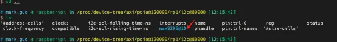
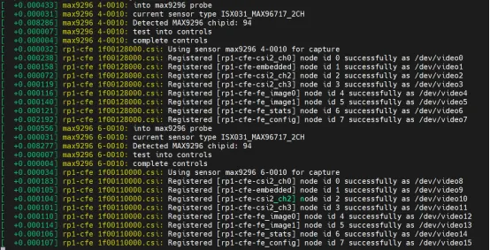

GMSL相机接入套件驱动
====================================
本仓库提供了GMSL相机接入树莓派5（Raspberry Pi 5）平台的驱动。该驱动仅适配艾利光（http://www.aili-light.com） 的GMSL摄像头模组和转接板。

# 前置条件
1. GMSL摄像头模组(https://www.aili-light.com/alg-automotive-camera/)  
2. 转接板(https://www.aili-light.com/alg-GMSL-camera-adapter-kit/Raspeberry-pi5-GMSL-camera-adapter-kit.html)  
3. 树莓派5(https://www.raspberrypi.com/products/raspberry-pi-5/)  

# 设备树的加载
1. 拷贝Git仓库中的max9296\bin\6.6.31+rpt-rpi-2712\dtbo\max9296.dtbo, 到树莓派的/boot/firmware/overlays/ 目录。  
```bash
sudo cp </path/max9296.dtbo> /boot/firmware/overlays/
```
2. 执行加载DTBO到设备树
这里需要在config.txt文件中添加max9296.dtbo的支持，参考指令：
```bash
sudo vim /boot/firmware/config.txt
```
并输入传感器参数，这里我们以艾利光科技摄像头为例，添加以下参数：
```bash
dtoverlay=max9296,sensor-type=ISX031_MAX96717_2CH
dtoverlay=max9296,cam0,sensor-type=ISX031_MAX96717_2CH
```
最终config.txt中的配置如下：
The config file looks like:  
```bash
[all]
#dtoverlay=max9296,sensor-type=0X08B MAX96717 1CH
#dtoverlay=max9296,cam0,sensor-type=0X08B MAX96717 1CH
dtoverlay=max9296,sensor-type=ISX031 MAX96717 2CH
dtoverlay=max9296,cam0,sensor-type=ISX031 MAX96717 2CH
#dtoverlay=max9296,sensor-type=ISX031 MAX96717 1CH
#dtoverlay=max9296,cam0,sensor-type=ISX031 MAX96717 1CH
#dtoverlay=max9296,sensor-type=ISX031 MAX96717 2CH
#dtoverlay=max9296,cam0,sensor-type=0X08B MAX96717 1CH
```
重启后，可以通过执行以下指令来验证Overlay是否已成功加载。若系统中出现名为max9296的设备节点，则表明Overlay加载成功。
```bash
cd /proc/device-tree/axi/pcie@120000/rp1/i2c@80000/max9296@10
```


# 在树莓派傻上加载驱动
1. 获取树莓派的内核版本  
```bash
$ uname -r
```
2. 把Git仓库中对应内核版本的.ko文件放置到/lib/modules/{内核版本号}/目录下。  
```bash
sudo cp </path/kernel_2712.img> /lib/modules/{$kernel_version}/
```
3. 运行depmod和modprobe    
```bash
sudo depmod
sudo modprobe max9296
```
当驱动加载成功后，dmesg命令会输出相应的日志信息。若日志内容中未出现任何错误报告，则表明驱动已成功加载。


# 配置media pipe
在Raspberry Pi 5的原生CFE（固件环境）驱动中，CSI2和CFE并未直接串联。因此，需要手动重新配置pipe（管道）。为此，我们已编写了一个脚本，并放置在Git仓库的max9296\script\路径下。您可以将该脚本中的aili_run_camera.sh文件复制到Raspberry Pi上的任意位置，并执行以下命令来运行：
```bash
./aili_run_camera.sh csi_channel width hight deserdes_channel
```
** 参数解析：
- csi_channel ：表示指定使用的CSI（Camera Serial Interface）通道。所有可配置参数如下：
  csi0 -- 使用csi0，参考硬件连接的示意图
  csi1 -- 使用csi1，参考硬件连接的示意图
  all  -- 同时使用csi0和csi1
- width : 表示当前该CSI通道所连接的Sensor（传感器）分辨率的宽度。
- height：表示当前该CSI通道所连接的Sensor（传感器）分辨率的高度。
- deserdes_channel：用于指定是使用一个还是两个deserdes通道。当仅使用一个通道时，需使用LINKA，配置参数如下：
  1ch -- 使用deserdes的一个通道，LINKA
  2ch -- 使用deserdes的两个通道

** 示例:  
```bash
./aili_run_camera.sh all 1920 1536 2ch //
```
表示同时使用csi0和csi1，分辨率设置为1920x1536，deserdes的两个通道同时输出,即同时采集4路图像。  
执行完毕后，若控制台显示已执行的指令且未报错，则表明操作已成功完成。    

# 使用gstreamer显示图像
您可以使用位于max9296\script\路径下的脚本来同时显示图像。请将其中的aili_review_camera.sh脚本文件复制到Raspberry Pi上的任意位置，并在该位置执行以下指令来启动图像显示功能。  
```bash
./aili_review_camera.sh csi_channel width hight deserdes_channel
```
** 参数解析：
- csi_channel ：表示指定使用的CSI（Camera Serial Interface）通道。所有可配置参数如下：  
  csi0 -- 使用csi0，参考硬件连接的示意图  
  csi1 -- 使用csi1，参考硬件连接的示意图  
  all  -- 同时使用csi0和csi1  
- width : 表示当前该CSI通道所连接的Sensor（传感器）分辨率的宽度。  
- height：表示当前该CSI通道所连接的Sensor（传感器）分辨率的高度。  
- deserdes_channel：用于指定是使用一个还是两个deserdes通道。当仅使用一个通道时，需使用LINKA，配置参数如下：  
  1ch -- 使用deserdes的一个通道，LINKA  
  2ch -- 使用deserdes的两个通道  

** 注意事项：
请确保此脚本的参数与./aili_run_camera.sh脚本的参数保持一致。  
该指令必须在具备图形用户界面的本地控制台执行，无法通过远程SSH连接执行。  